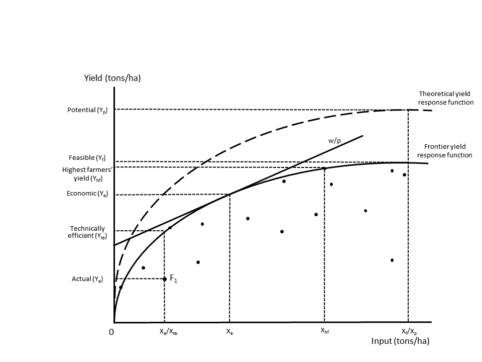

```{r setup, include=FALSE}
library(rprojroot)
root <- find_root(is_rstudio_project)

library(knitr)
knitr::opts_chunk$set(
  fig.width=12, fig.height=8,
  dpi = 300,
  echo=FALSE, warning=FALSE, message=FALSE,
  fig.path = file.path(root,"FigTabMap/out-"),
  dev = "CairoPNG",
  dev.args = list(CairoPNG = list(bg = "transparent"))
  )

library(pander)
panderOptions('table.alignment.default', function(df)
    ifelse(sapply(df, is.numeric), 'right', 'left'))
panderOptions('table.split.table', Inf)
panderOptions('digits', 2)
panderOptions('round', 2)
panderOptions('big.mark', ",")
panderOptions('keep.trailing.zeros', TRUE)

source(file.path(root, "Code/NGA_fig.R"))
source(file.path(root, "Code/NGA_tab.R"))
source(file.path(root, "Code/NGA_map.R"))
```

__Abstract__


__Acknowledgements__
We are grateful to the following persons for input and comments: Lenny van Bussel, Joao Vasco Silva. We thank the World Bank for making available an additional GPS dataset. We also would like to thank Lenis Saweda Liverpool-Tasie for assistance with the data. This work was supported by the International Maize and Wheat Improvement Center (CIMMYT) through the CGIAR research program on MAIZE and Wageningen UR.


# Introduction
Yield gap is a powerful concept to illustrate the possibilities to increase future crop yield and the investigate why actual yield is lower than the biophysical potential. It is defined as the difference between potential yield and actual yield observed at the plot, farm or regional level. Despite its abundant use, the yield gap can be defined and measured in a number of ways, which has resulted in lack of consistency in yield gap analysis in the literature [@Lobell2009]. Furthermore, in a recent review of the use of yield gap analysis in key policy papers @Sumberg2012 noted that _"there is a tension between the notion of yield gap as developed in crop ecology (although even here there is no single or consistent usage) and micro-economic studies"_ [p. 510]. 

The aim of this paper is to address some of these criticisms by integrating micro-economic and agronomic yield gap approaches into one single framework. The framework follows the reasoning of @Tittonell2013, who argue that the gap is caused by two main factors: (1) resource use intensity and (2) access and use of  technology. It also extends the work of @Fischer2015, who recently reviewed definitions of crop yield and yield gaps and builds on the work of @VanDijk2016 and @Silva2016, who combine agronomic and economic approaches to yield gap analysis and measurement. 

We start by critically reviewing the most common crop yield and yield gap definitions and highlight a number of inconsistencies in their definition and use. We demonstrate that 'actual yield' can be measured in different ways, leading to different yield gaps. Similarly the use of 'attainable yield' is fraught with difficulties and in practice have been used to define conceptually different production levels. We continue by critically addressing the use of the term 'exploitable yield level [@Cassman2003; @VanIttersum2013], sometimes referred to as 'economic yield level' [@Fischer2015]. Exploitable yield is normally used to capture the part of the yield gap that will not be closed because of economic constraints and is normally set to 75-85% of potential yield [@Cassman1999; @Cassman2003; @VanIttersum2013]. 

As pointed out by @Fischer2015, these numbers are based on "general experience" [p.11] and mainly represent to situations _"where there is no other competition for the farmers’ resources, and world prices and reasonable transport costs operate"_ [p.11]. He also points out that in situations Where this does not occur, such as Sub-Saharan Africa, which is characterized by poor infrastructure and weak institutions, the exploitable yield gap is expected to be much higher. Despite its weak underpinnings the 75-80% 'rule of thumb' is applied frequently as a 'target' in studies to assess potential to increase future crop production. [@VanOort2015; @AramburuMerlos2015], which can be potential misleading, in particular when applied to developing countries. We argue that the definition of (true) economic yield should be rooted in neoclassical economic theory, the dominant paradigm in economics, and be estimated using information on the prices of inputs and outputs. Analogue to arguments in crop ecology, which stress the localized nature of agroclimatic conditions, we argue that economic yield levels are location specific. It is well-known that in many developing countries (sub-national) trade is limited due to poor infrastructure resulting in isolated markets and differentiated market prices [@ADDREF]. 

To solve some of the inconsistencies with the existing yield and yield gap definitions our conceptual framework introduces three new yield levels that make it possible to decompose the conventional yield gap into a ' technical efficiency', 'economic', 'feasible' and 'technology'. We believe that our framework is able to capture all existing yield gap definitions and reveal the impact of resource intensity and technology on yield gaps.

To demonstrate our framework we present an application using a large nationally representative farm level survey on maize production in Nigeria. [ADD].For the integrated agronomic and economic analysis in this study we combine information from a number of sources. This section describes the various data sources and presents summary statistics for relevant variables.


The structure of the paper is as follows. Section 2 provides a conceptual framework that integrates varies definitions of yield levels and yield gap. Section 3 briefly discusses the Nigerian farm level maize data set that is used to illustrate the conceptual model. Section 4 computes the yield levels and yield gaps followed by a discussion in Section 5. Finally, Section 6 concludes. 

## Conceptual framework
We use the conceptual framework developed by @Vandijk2016 to decompose the conventional yield gap. Figure 1 shows the observed input and output combinations of a number of agricultural units (e.g. field, farm or region). For purpose of illustration, we assume that the observations are small-scale farms in Africa, who produce a single output (e.g. maize) using one input (e.g fertilizer), agroecological conditions are identical for all farms and water is not limited. The _theoretical yield response function_ describes the relationship between yield and inputs under perfect crop management and most advanced technology. The maximum of the function is the potential yield level. The _frontier yield response function_ is estimated using actual observations from a sample of farmers or plots in a specific country or region. It measures best-practice performance at all input levels and reflects the best management practices and technology that are available in the region. The diagonal line presents the relative input ($w$) and output ($p$) market price faced by the farmers. 

Figure 1 depicts the two yield levels that determine the conventional yield gap, actual yield ($Y_a$) for farm $F_1$ and potential yield ($Y_p$) as well as the associated input levels. Similar to @Tittonell2013, we argue that the yield gap is caused by two main factors. The first is resource use intensity. The relationship between resource use and yield is given by the yield response curve. Intensification will results in higher yields, represented by a movement over the curve to the right. We argue that for the majority of farmers the decision on how much inputs to use depends on economic considerations (i.e. profit maximization behavior). Under the assumption of perfect functioning agricultural markets and full information, the demand for inputs will solely depend on relative market prices of inputs and output, and production technology [@Sadoulet1995]. In developing countries, the assumption of perfect markets is not realistic because of high transaction cost, missing credit and insurance markets and lack of information on input and output prices and available technologies [@Stiglitz1989; @Dillon2014]. Under these circumstances, the demand for inputs tends to be lower than the economic optimum resulting in lower output and yield [@Kelly2003]. In some cases, farmers the input decision of farmers can be guided by other non-economic objectives such as environmental awareness or output targets [Ref to RUE Rabbinge? - Example] resulting in sub optimal economic input use.  

The second major cause of yield gaps is related to the efficient use and adoption of technology. Two different aspects are relevant. The first is technical efficiency, which is defined as the farm’s ability to produce maximum output given a set of inputs and technology [@Farrell1957a; @Coelli2005]. Best-practice farmers, who are located on the yield response frontier, are considered technically efficient. Farmers below the frontier are considered inefficient because they have a lower yield despite using the same level of inputs and experience the same agroecological conditions. Technical inefficiency implies that crop management is sub optimal, referring to differences in planting dates, spacing, weeding and form of the inputs applied, which, in turn can be related differences in experience and practices, and access to extension services [see @Bravo-Ureta2007; @Ogundari2014 for reviews].

The second technology aspect is the adoption of advanced technologies. As has been pointed out by @Tittonell2013 most small-scale farmers are subsistence farmers with limited access to appropriate technologies. Even if resource availability would not be a problem and farmers would produce at best-practice level, there would still be a gap with the potential yield level. Closing this gap would require the use of advanced technologies such as precision agriculture, advanced crop management and the adoption of the latest varieties (hybrid seeds). The adoption of advanced technologies will help farmers to increase their yield to a level that previously not could be attained. The effect is an upward shift of the frontier yield response curve in the direction of the theoretical yield response curve and a reduction of the yield gap.

Figure 1 depicts the five yield levels that can be derived on the basis of the economic, technical efficiency and technology constraints discussed above: 

- _Potential yield_ is defined as _“the yield of a cultivar when grown in environments to which it is adapted, with nutrients and water non-limiting and with pests, diseases, weeds, lodging, and other stresses effectively controlled”_ [@Evans1999]. It depends on local climate and weather factors, including  atmospheric CO2 emissions, solar radiation, temperature as well as plant characteristics but is independent of soil, which is assumed to be physically and chemically favorable to crop growth [@VanIttersum1997; @Sadras2015]. _Water-limited potential yield_ is similar to potential yield but takes into account that water supply is limited, which is particularly relevant for rain fed crops such as maize in Nigeria.

- _Technical efficiency yield_ measures best-practice performance for a field, farm or region at each input level and reflects the available technology and best management practices in the sample.

- _Economic yield._ is defined as the yield level where profits are maximized [@VanDijk2016]. At this level, the marginal cost of acquiring an additional unit of input (e.g. fertilizer) is equal to the marginal revenue of producing an additional unit of output (e.g. tons of maize). This is a situation of allocative efficiency where Inputs and outputs are distributed in an economic optimal way. This definition of economic yield is consistent with neoclassical economic theory, the dominant paradigm in economics, which postulates that economic actors (e.g. farmers) maximize profits (not production), subject to given output prices, input costs and production technology [@Sadoulet1995]. _Economic yield_ is identified by the point where the relative market price line ($w/p$) is tangent to the frontier yield response function. We prefer this definition over the use of _exploitable yield_ and _economic yield_ outlined above, which are based on a 'rule of thumb' rather than theoretical assumptions.

- _Feasible yield._ Feasible yield represents the maximum feasible yield that can be reached on a plot with the available technology and best-practice management but without any economic constraints (e.g. inputs are free). This yield level is also sometimes referred to as ‘potential farm yield’ [@Datta1981], ‘maximum attainable yield’ [@FAO2004] and ‘technical on-farm ceiling yield’ [@DeBie2000]. It has the same meaning as the definition of _attainable yield_ used by @Sadras2015 and @Tittonell2013. 


- _Exploitable yield._ is defined as 70-85% of (water-limited) potential yield. The 70-85% is used as a 'rule of thumb' to capture the empirical finding that yield levels tend to stagnate at around 70-85 percent of potential yield [@Cassman1999; @Cassman2003; @Lobell2009, @VanIttersum2013, @Fischer2015]. The explanation for  stagnating yield levels is mainly economic. For most farmers it will not be cost-effective to purchase the large amount of inputs (e.g. fertilizer) that are needed to produce at the potential yield level [@Fischer2014] nor will farmers be willing to pay for the additional costs that are needed to 'fine-tune' crop and soil management [@Cassman2003]. @Fischer2015, uses exact the same definition but calls it_economic yield_.

- _Attainable yield_ is used frequently in the yield gap literature but often in a rather ad hoc and inconsistent way, meaning a variety of things. Fischer and colleagues [@Fischer2014; @Fischer2015] equate attainable yield with *economic yield* by defining it as *'the yield attained by a farmer from average natural resources when economically optimal practices and levels of inputs have been adopted while facing the vagaries of weather'* [p.32]. @Sadras2015 use the following definition: *'the best yield achieved through skilful use of the best available technology'* [p. 6]. A similar definition is provided by [@Tittonell2013], who defined coin the term 'locally attainable yield', which is *the maximum yield achievable by resource endowed farmers in their most productive fields'* [p78]. Clearly, the definition of attainable yield by @Sadras2015 and @Tittonnell2013 differs from that of Fischer and colleagues [@Fischer2014; @Fischer2015] because it reflects the highest possible yield that can be reached with best available technology and not economic constraints. Finally, several researchers take an empirical approach and refer to attainable yield as the average of the (90 or 95 percentile) highest yield in the sample of observations [@Hall2013; @Mann2017]. In many cases, the empirically observed attainable yield is used to approximate (water-limited) potential yield when results from crop simulation, the preferred measure [@VanIttersum2013], are not available.  


The figure also depicts the _highest farmers' yield_, which is defined as the average of the top 90 or 95 percentile actual yield observed in a sample of farmers or plots [@Laborte2012; @Silva2016] but displayed as a single observation for convenience. Highest farmers' yield is [@REF TO TITONELL AND GILLER] In the present situation highest farmers' yield is much higher than economic yield. This implies that, given relative market prices ($w/p$) the farmer with the highest yield is not producing at the economic optimum level. Potential reasons for this behavior might be [ADD]. Another reason might be that the actual relative price of the farmer is lower than the market because of (fertilizer) subsidies, which are common practice in many sub-Saharan African countries.

Hence, this particular situation demonstrates that the _highest farmers' yield_ is not a good proximate for _economic yield_. On the other hand, although resource use differs considerably (the difference between $X_f$ and $X_hfy$) the _highest farmers' yield_ is very close to the _feasible yield level_. A well-known observation in agronomy is that the response to inputs is decreasing (or even stagnates or becomes negative) [REF], at high levels of input use. Hence, despite constraints to resource use, the yield of farmers with the highest yield is likely to be close to the feasible yield level [WILL CHECK IF THIS IS THE CASE FOR NIGERIA]. For this reason, we argue that the _highest farmers_yield is an acceptable indicator if one is interested in having a benchmark for the maximum yield achievable on a field using the best-available technology. It is an empirical question whether actual yield, technical efficiency yield, economic yield and feasible yield are located at or close to the same point. This is further investigated below.

**Figure 1: Conceptual framework**

```{r Figure-1}

#knitr::include_graphics(file.path(root, "FigTabMap/Yield_Gap_Framework.png")) Does not work for some reason..
```

##### Source: 

The total yield gap ($Yg$) can be decomposed in four parts: the technical efficiency yield gap ($TEYg$), the allocative yield gap ($AYg$), the economic yield gap ($EYg$) and the technology yield gap ($TYg$) [@VanDijk2016]. Table 1 summarizes the definitions and potential causes for the the five yield gaps that can be derived from Figure 1. 

Global studies of yield gaps clearly show that the (total) yield gap is highest in sub-Saharan countries like Nigeria [@Mueller2012; @Licker2010; @Neumann2010]. The decomposition of the yield gap provides a deeper understanding for this finding and its causes. Knowledge constraints (e.g. access to extension services) result in technical efficiency yield gaps while pervasive market failures that characterize (agricultural) input and output markets in many sub-Saharan countries will lead to economic yield gaps. Similarly , we expect a large feasible yield gap because of the unfavorable balance between input and output prices in sub-Saharan countries. This is underscored by the high fertilizer price in many sub-Saharan countries caused poor dealer networks, high transportation costs and small market size [@Morris2007]. Finally, the technology yield gap is also expected to be large. [ADD evidence technology use in Africa]. The existence of (agricultural) technology gaps between rich and poor countries has been studied widely [@Fagerberg1994, @Mekonnen2015, @Headey2010a] and can been related to the combination of broader institutional, technological, economic and social factors.

###### PAGE BREAK

**Table 1: Yield gaps**

```{r Table 1}
library(readr)
library(knitr)
Tab_YG <- read_csv(file.path(root, "FigTabMap/Table-1.csv"))
kable(Tab_YG)
```

##### Source: 

CHECK We also estimate highest farmers' yield to assess if it is close to any of the theoretical yield levels. A major problem with using highest farmers' yield in ##is dealing with the variation in agroecological conditions across the sample. In large samples such as the LSMS-ISA for Nigeria that cover plots in all #parts of the country, potential yield in the XXX zones much lower than that of farmers in XX zones [Figure X]. Simply taking the average yield of the top 95 #percentile of the complete sample will results in a highly biased benchmark. To only way to overcome this issue would be to take averages per agroecological #zone [@mann]. However, it seems that this is not done in most studies [CHECK].


# Data
## Potential yield
Potential water-limited yield is taken from the global yield gap atlas (GYGA, www.yieldgap.org). GYGA is an international project that presents consistent estimates of potential yield and yield gaps combining best available data, robust crop simulation models and a bottom-up approach [@VanIttersum2013, @Grassini2015a] for nine major food crops in a large number of countries, including maize in Nigeria. To aggregate (simulation) results from location-specific observed data to larger spatial areas, GYGA uses a climate zonation scheme [@VanWart2013, @VanBussel2015]. Climate zones are based on a matrix of three climatic variables: (i) growing degree days (GGD, divided in 10 classes), (ii) aridity index (AI, divided into 10 classes) and (iii) temperature seasonality (3 classes) that give a total of 300 classes (of which 265 are relevant for food production). Each climate zone has an unique value that indicates the climatic characteristics. It is constructed as the sum of the three components, for example a value of 9301 refers to a GGD of 9000, an AI of 300 and a temperature seasonality of 1. Figure 2 depicts the climate zones and associated potential water-limited yield for Nigeria. 


**Figure 2: Yield gap and LSMS**

```{r Figure-2}
GYGA_LSMS
```

##### Source: Potential water-limited yield from GYGA and actual yield by enumeration area from the World Bank LSMS-ISA surveys.
##### Note: Coloured areas refer to the seven climate zones for which >=50 observations from the LSMS-ISA are available. Grey areas indicate climate zones for GYGA presents information but for which not enough LSMS-ISA observations are available. White areas are not covered by GYGA. Actual yield is based on the pooled sample and weighted by plot size. 


## Farm and plot level data
The plot and farm level data come from the nationally representative 2010-11 and 2012-13 waves of the  Nigeria General Household Survey (GHS). In total the GHS is a cross section of 22,000 households, 5,000 of which were included as panel households as part of the Living Standards measurement Study Integrated Surveys in Agriculture (LSMS-ISA) initiative.  The focus of the LSMS-ISA is to improve the quality of data on the agricultural sector and was conducted by the National Bureau of Statistics in partnership with the Federal Ministry of Agriculture and Rural Development, the National Food Reserve Agency, the Bill and Melinda Gates Foundation and the World Bank. In each wave, households were visited twice reflecting the post planting and post harvest visits. The data was collected at several levels, including at the plot, household and enumeration area level, and the location of each household was GPS recorded with an offset to preserve household anonymity.

### Basic information
The agricultural questionnaire of the LSMS-ISA records key information at the plot level including the quantity of crop harvested, type and quantity of fertilizer applied, seed use and the area of the plot. Plot area measurements were recorded by GPS in each wave, and where it was not possible to record the GPS area, for example due to cloudy weather, the World Bank provides a complete set of plot areas with imputed missing values [@Palacios_Lopez]. From this information maize yield, and nitrogen and seed application rates can be calculated. The LSMS-ISA also provides information on harvested crop area, which can be used as an alternative to plot area for the estimation of maize yield. Finally, the LSMS-ISA presents information on economic production factors, including farms assets, use of animal traction and labour.  

Exploratory data analysis showed that several variables clearly fell outside a plausible range. We followed the approach of other studies that use similar plot and farm level surveys [@REF] and winsored outliers that were more than three standard deviations [@Absolute deviations?] from the median. Winsoring involves replacing extreme values with the value at a pre-defined threshold (in this case three standard deviations) instead of than dropping the observation completely. To deal with outliers in nitrogen application rates, we follow @SHEAHAN-CHECK and cap the use of nitrogen to 700 kg per hectare, the upper-limit of inorganic fertilizer use in the United States under irrigated conditions.[@CHECK]. We also decided to remove plots that have an area of less than 0.05 ha for which GPS measurements are less accurate and more than 10 ha, which we do not consider small scale farmers. Finally, we remove a small number of plots that have a maize yield of more than 15.9 tons per ha, the highest potential yield in Nigeria according to GYGA.

To estimate the frontier yield response function we used all available data on maize production in Nigeria provided by the LSMS-ISA (@observations  in total). Out of these, @XX [@X] are located in GYGA climate zones (Figure X). In order to have sufficient observations, we focus the analysis on seven climate zones for which >=50 observations are available (@X% of the observations in climate zones).  Table 2 presents key statistics per climate zone and summary statistics for all variables are presented in the appendix. The table demonstrates the diversity in farming systems across climate zones in Nigeria. Zones 9301 9901 are characterised by relative high fertilizer application rates and yield, while zones 9701 and 9801 show relative low levels of intensification and yield. [@compare with systems?] 


**Table 2: Descriptive statistics per climate zone**

```{r Table-2}
pander(Tab_CZ)
```

##### Source: LSMS-ISA and GYGA
##### Note: *Conditional on use of nitrogen. All Yield and yield gap values are weigthed values using plot or harvested area as weights. Nitrogen values use plot area as weights. 


### Plot versus harvested area
In yield gap analysis it is common practice to apply the FAO definition for actual (farm) yield, which  expresses yield relative to harvested land area [@Fischer2015]. In a recent study @Reynolds argue that this definition leads to serious overestimation of actual yield because it ignores crop losses that might occur between planting and harvesting. Hence, they recommend to use a definition of yield relative to crop area. Causes for the difference in area planted and area harvested include crop management factors (e.g. poor germination, damage from pests and diseases) and economic constraints (e.g. labor and capital constraints and shortage of market opportunities). These are precisely the issues that one aims to capture with yield gap analysis. It is likely that crop management and resource use decisions of farmers are based on the total plot area that they consider for agricultural production, not only the harvested area. Assessments using a definition based on harvested area therefore probably underestimate the yield gap. Using a definition based on plot area,  on the other hand, will probably overestimate the gap, in particular when part of a plot is not suitable for agricultural production (e.g. rocks) or when more than one crop is grown on a plot (e.g. intercropping or presence of fruit trees). Multicropping is an important issue in our sample as on @X of the plots more than one crop is grown. Yield based on harvest area and plot area can therefore be considered as upper and lower bounds of actual yield.

The LSMS-ISA provides information on both plot area and harvested area so that we can investigate the choice of definition on yield gap measurement. Unfortunately harvested crop area is only available as a farmer self-reported estimate, while plot area is available as self-reported and gps measure. The latter is highly preferred as self-reported values are characterized by systematic errors [@Carletto2015a]. Although it is likely that self-reported harvested and plot area are biased, we assume that their relative value is less prone to error. Farmers are probably better able to assess the share of area planted than the absolute area. Hence, we estimate the harvested area as follows:    

$$ Harvested\:area= Plot\:area\:(gps) * \frac {Harvested\:area\: (farmer-assessed)}{Plot\:area\:(farmer-assessed)} $$

### Input and output price information
A key objective of this study is to investigate the economic constraints to closing the yield gap. For this we need information on maize and fertilizer price. The LSMS-ISA presents plot-level information on both the value and quantity of maize sold  and fertilizer purchased. We used this to calculate plot level prices. Following @Sheahan we applied the chemical composition of fertilizer to estimate the price of Nitrogen. To remove the effect of outliers, we winsored all data at 1.5 times the median value. In case plot-level data was missing we used the regional, zonal or national average price level as a substitute.

Figure 3 shows the distribution of maize and nitrogen prices per climate zone in Nigeria. Prices vary considerably within and between zones. In the Nothern (9301) and central climate zones (9401, 9501 and 10401) maize prices are relatively higher than in the Southern climate zones (9701, 9801, 9901). Nitrogen prices also show spatial variation but differences between climate zones are less pronounced. The wide range of prices illustrates that market conditions vary within Nigeria, which are likely to have an impact on producion decisions of the farmer and resulting yield levels.

**Figure 3: Maize and Nitrogen prices**

```{r Figure-3}
Fig_price
```

##### Source: LSMS-ISA


## Climate and soil variables
To control for impact of soil conditions on actual yield, he LSMS-ISA data with spatial information from the Africa Soil Information Service (AfSIS, http://africasoils.net). AfSIS presents soil property maps for Africa at 250m spatial resolution and various depths based on 28 thousand sampling locations [@Hengl]. We use the gps coordinates of the LSMS-ISA enumeration areas to link data on soil organic carbon stock and pH for the top 200 cm soil layer from AfSIS. These indicators are frequently used as covariates in yield response function estimates [@Marenya, @Burke] as a measure of soil quality. Information on rainfall is directly available from the LSMS-ISA datasets.     


# Estimation of yield levels
We use stochastic frontier analysis [@Meeusen1977; @Aigner1977] to estimate the frontier yield response curve in Figure 1. This approach is somewhat comparable to boundary line analysis [@REF], which is often used to estimate yield gaps. Similar to boundary line analysis stochastic frontier analysis also estimates an envelope curve that represents best-practice yield at each level of input. It has the the advantage that it simultaneously takes into account multiple inputs instead of addressing only one input as is the case in boundary analysis. Stochastic frontier analysis is increasingly used to estimate yield gaps [@Henderson2016, @Hoang2013, @Silva2016, @Neumann2010]. 

The stochastic frontier yield response function is defined as follows: 
$$ y_i=\alpha_0 + \sum\beta A_g + \sum\delta E_i + \sum\theta C + v_i-u_i $$
where, $y_i$ is the logarithm of actual yield for maize plot $i$, $A_g$ is a vector containing agronomic amd biophysical variables at the grid $g$ level, $E_i$ is a vector containing economic variables, $C$ is a vector representing control variables, $\beta$, $\delta$, $\theta$ are vectors of parameters and $v_i$  is a symmetric random error. $u_i$ is non-negative random variable with a half normal distribution that measures the technical efficient yield gap.

As small-scale farmer yield depends both on agronomic and economic conditions [@REFGuangyield, @Liverpool], we include both in the yield response function. Biophysical variables slope and elevation of the plot. Availability of water is measured by means of growing season rainfall data and a @dummy variable for irrigation. The use of fertilizer is captured by the application rate of nitrogen. As only @X percent of the plots in the sample uses fertilizer, we add a dummy to control for structural differences between plots with and witout fertilizer [@Battese1997].  We control for differences in soil by using information on soil organic carbon (SOC) stock and pH from the AfSIS dataset. We follow Burke [-@Burke] and apply threshold values for pH of 5.5 and 7, which demarcate the optimal conditions for maize growth. We include economic production variables that are related to farm management practices, farm assets, labour and  farm size (measured by total plot area). As labour data is missing in the first wave, we follow the approach of @Liverpool-Tasie2016a and use household adult equivalency units as a proxy. Finally, we include control variables for pure maize plots (sole crop as opposed to multicrop) and survey year. 

There exists a large literature on the functional form of the yield response function. Most studies that use experimental trail data have found that the find that linear response and plateau functions (i.e. Mitscherlich-Baule and Von Liebig) give the best results. This functional form assumes that plant growth is constrained by the most limiting input which is the same for all observations [@Paris1992, @ADD]. This assumption  is hard to maintain when analysing farmer survey data, which is characterised by a high level of heterogeniety. For this reason, quadratic, translog and Cobb-Douglas functions are typically applied when estimation yield response functions in socio-economic research settings [@Sherlund2002, @Sheahan]. The use of these more flexible functions is confirmed by Berck and Helfand [@Berck1990], who demonstrate that under heterogenous conditions the results from  linear response and plateau models converge to those of Cobb-Douglas and quadratic functions. To keep things tractable, we use the relative simple Cobb-Douglas function in this study. 


# Results
## Frontier yield response estimation

**Table 3: Frontier yield response curve estimation**

````{r Table-3}
pander(Tbl_sfa)
```

##### Note: 

## Yield levels

**Figure 4: Yield levels: comparing models**

```{r Figure-4}
Fig_gps_harv_comp
```

##### Source: 


## Yield levels

**Figure 5: Yield levels**

```{r Figure-5}
Fig_YL
```

##### Source: 


##  Yield gaps
To calculate potential yield, the GYGA identifies climate zones, which have similar biophysical conditions [@VanBussum]. There are in total XX Climate zones in Nigeria. Climate zones are defined by their XX number.

In this study we focus on the main maize producing area in Nigeria for which we have sufficient number of observations over space and time. Most maize is produced in seven out of the XX climate zones that are defined by the GYGA. In order to have sufficient units for our analysis we set the minimum number of observations to 50 per climate zone. Our final sample accounts for X percent of the total maize plots in Nigeria for which information is presented in the LSMS-ISA (Annex A). Most maize is produced in the cereal root crop mixed farming systems zone that forms a belt over Nigeria that expands from East till West [@REFFS]. This zone is characterised by by XX and XX. [compare with other CZs and refer to table in Annex] [@Liverpool]. Hence, although our findings are not representative for total maize production in Nigeria, they can be considered for the main maize regions in the country. 

Table x presents summary statistics for the climate zones that are located in the maize producing regions and Figure combines information from the LSMS-ISA and the GYGA (see annex X for the locations of the CZs). 


**Figure 6: **

```{r Figure-6}
Fig_YG
```

##### Note: 


- calculate different yield gaps, also attainable yield gap and show differences

- Compare distributions of yield gap per zone. 

Comparison with literature

Compare highest farmer yield with economic and feasible and show difference!!


# Discussion 

Main findings

- Reviewed conventional yield levels used in agronomic literature and revealed some inconsistencies in the use and definition of certain yield levels. In particular the use of attainable yield and exploitable yield.
- We present a consistent framework that decomposes the conventional yield gap into four parts that are firmly rooted in neoclassical economics and therefore provide a theoretical framework on explaining why yield falls below potential. 
- We also demonstrated how the impact of actual yield definitions on yield gap. 


Recommendations:

- We recommend that attainable yield gap is not used as it is a highly confusing term as it can mean: economic yield, technical efficiency yield or . We propose to use the definitions that actually. We have similar objections to the term exploitable yield, which is based on a rule of thumb. Better to use..
- We recommend that researchers are clear about their definition of actual yield. There is no perfect solution for the definition of area when measuring actual yield. Plot size is probably the best measure if one wants to capture all factors that cause the yield gap (including for example the economic or biophysical reasons, why a farmer did not harvest the full plot) but raises difficulties in situations where multiple crops are grown on one plat. On the other hand, harvest yield [ADD]. In any case researchers should properly explain which definition they used to measure actual yield. 


Limitations

- study only covers two years. Recommended number of years is 5(?). Actual yield might be biased because of outliers. Better to use more years, possible in the future when LSMS is repeated.

A subsidy program did exist in Nigeria over the course of this survey. However, farmers were not asked whether they received these subsidies for the fertilizer they purchased which may also have consequences for the analysis ... 


Data issues
- Biophysical data not that responsive. Soil informaiton is key. Linking (offset) and course information probably cause => need soil sample linked information (ICRAF initiative).
- Hybrid seeds data missing.


# Conclusions

# Appendix

ADD SUMMARY STATISTICS.

# References