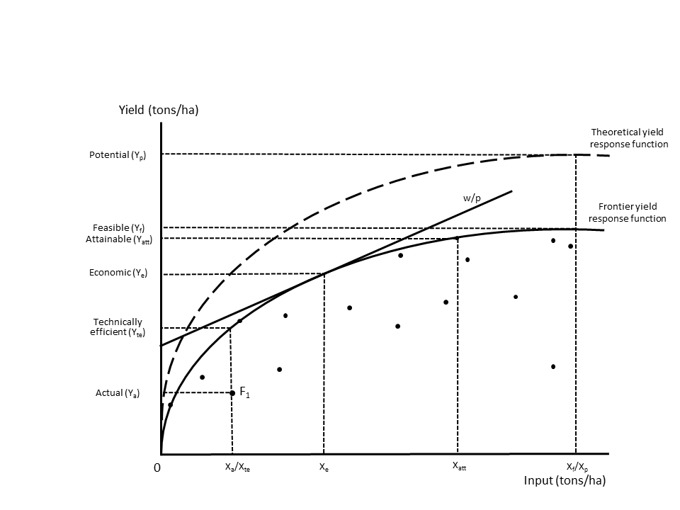

```{r setup, include=FALSE}
knitr::opts_chunk$set(echo = TRUE)
library(rprojroot)
root <- find_root(is_rstudio_project)
knitr::opts_chunk$set(echo = FALSE, fig.height = 10, fig.width = 10)
#source(file.path(root ,"Code/NGA_FigTab.R"))
```

# Introduction
Yield gap is a powerful concept to illustrate the potential to increase future crop yield. It is defined as the difference between potential yield and actual yield observed at the plot, farm or regional level. Despite its abundant use, the yield gap can be defined and measured in a number of ways, which has resulted in lack of consistency in yield gap analysis in the literature [@Lobell2009]. Furthermore, in a recent review of the use of yield gap analysis in key policy papers @Sumberg2012 noted that _"there is a tension between the notion of yield gap as developed in crop ecology (although even here there is no single or consistent usage) and micro-economic studies"_ [p. 510]. 

The aim of this paper is to address some of these criticisms by integrating micro-economic and agronomic yield gap approaches into one single framework. The framework follows the reasoning of @Tittonell2013, who argue that the gap is caused by two main factors: (1) resource use intensity and (2) access and use of  technology. It also extends the work of @Fischer2015, who recently reviewed definitions of crop yield and yield gaps and builds on the work of @VanDijk2016 and @Silva2016, who combine agronomic and economic approaches to yield gap analysis and measurement. 

We start by critically reviewing the most common crop yield and yield gap definitions and higlight a number of inconsistencies in their definition and use. We demonstrate that 'actual yield' can be measured in different ways, leading to different yield gaps. Similarly the use of 'attainable yield' is fraught with difficulties and in practice have been used to define conceptually different production levels. We continue by ritically addressing the use of the term 'exploitable yield level [@Cassman2003; @VanIttersum2013], sometimes referred to as 'economic yield level' [@Fischer2015]. Exploitable yield is normally used to capture the part of the yield gap that will not be closed because of economic constraints and is normally set to 75-85% of potential yield [@Cassman1999; @Cassman2003; @VanIttersum2013]. 

As pointed out by @Fischer2015, these numbers are based on "general experience" [p.11] and mainly represent to situations _"where there is no other competition for the farmers’ resources, and world prices and reasonable transport costs operate"_ [p.11]. He also points out that in situtations Where this does not occur, such as Sub-Saharan Africa, which is characterised by poor infrastructure and weak institutions, the exploitable yield gap is expected to be much higher. Despite its weak underpinnings the 75-80% 'rule of thumb' is applied frequently as a 'target' in studies to assess potential to increase future crop production. [@VanOort2015; @AramburuMerlos2015], which can be potentialy misleading, in particular when applied to developing countries. We argue that the definition of (true) economic yield should be rooted in neoclassical economic theory, the dominant paradigm in econimics, and be estimated using information on the prices of inputs and outputs. Analogue to arguments in crop ecology, which stress the localised nature of agroclimatic conditions, we argue that economic yield levels are location specific. It is well-known that in many developing countries (subnational) trade is limited due to poor infrastructure resulting in isolated markets and differentiated market prices [@WorldBank]. 

To solve some of the inconsistencies with the existing yield and yield gap definitions our conceptual framework introduces three new yield levels that make it possible to decompose the conventional yield gap into a ' technical efficiency', 'economic', 'feasible' and 'technology'. We believe that our framework is able to capture all existing yield gap definitions and reveal the impact of resource intensity and technology on yield gaps.

To demonstrate our framework we present an application using a large nationally representative farm level survey on maize production in Nigeria. [ADD].

The structure of the paper is as follows. Section 2 provides a conceptual framework that integrates varies definitions of yield levels and yield gap. Section 3 briefly discusses the Nigerian farm level maize data set that is used to illustrate the conceptual model. Section 4 computes the yield levels and yield gaps followed by a discussion in Section 5. Finally, Section 6 concludes. 


# Background
## Conventional yield levels
For the discussion it is relevant to briefly summarise the convential yield levels that are used in the agronomic literature to estimate yield gaps.

- _Actual yield_ also sometimes referred to as (average) farm yield [@Fischer2015; @VanIttersum2013], is the average annual yield obtained by farmers in a geographic area for a given crop with a given water regime [@Grassini2015a]. [SOmething on moisture level and harvested area]

- _Potential yield_ is defined as _“the yield of a cultivar when grown in environments to which it is adapted, with nutrients and water non-limiting and with pests, diseases, weeds, lodging, and other stresses effectively controlled”_ [@Evans1999]. It depends on local climate and weather factors, including  atmospheric CO2 emissions, solar radiation, temperature as well as plant characteristics but is independent of soil, which is assumed to be physically and chemically favourable to crop growth [@VanIttersum1997; @Sadras2015]. Potential yield is the preferred benchmark for irrigated crops, where precipitation is not a constraining factor. 

- _Water-limited potential yield_ (or just water-limited yield) is similar to potential yield but takes into account that water supply is limited, which is particularly relevant for rainfed crops. It is therefore strongly influenced by the water holding capacity and rooting depth of the soil, which regulate the supply of water. Water-limited potential yield is the reference value to estimate yield gaps for rainfed crops.

- _Exploitable yield._ is defined as 70-85% of (water-limited) potential yield. The 70-85% is used as a 'rule of thumb' to capture the empirical finding that yield levels tend to stagnate at around 70-85 percent of potential yield [@Cassman1999; @Cassman2003; @Lobell2009, @VanIttersum2013, @Fischer2015]. The explanation for  stagnating yield levels is mainly economic. For most farmers it will not be cost-effective to purchase the large amount of inputs (e.g. fertilizer) that are needed to produce at the potential yield level [@Fischer2014] nor wil farmers be willing to pay for the additional costs that are needed to 'fine-tune' crop and soil management [@Cassman2003]. @Fischer2015, uses exact the same definition but calls it_economic yield_.

- _Attainable yield_ is used frequently in the yield gap literature but often in a rather ad hoc and inconsistent way, meaning a variety of things. @Fischer2014; @Fischer2015 equates attainable yield with *economic yield* by defining it as *'the yield attained by a farmer from average natural resources when economically optimal practices and levels of inputs have been adopted while facing the vagaries of weather'* [p.32]. @Sadras2015 use the following definition: *'the best yield achieved through skilful use of the best available technology'* [p. 6]. A similar definition is provided by [@Tittonell2013], who defined coin the term 'locally attainable yield', which is *the maximum yield achievable by resource endowed farmers in their most productive fields'* [p78]. Clearly, this use of attainable yield differs from the previous definition as it reflects the highest posible yield that can be reached with best available technology, not economic constraints. Finally, several researchers take an empirical approach and refer to attainable yield as the average of the (90 or 95 percentile) highest yield in the sample of observations [@Hall2013; @Mann2017]. In many cases, the empirically observed attainable yield is used to approximate (water-limited) potential yield when results from crop simulation, the preferred measure [@VanIttersum2013], are not available.  

- _Highest farmers' yield._ (or best farmers' yield) is average of the top 90 or 95 percentile actual yield observed in a sample of farmers or plots [@Laborte2012; @Silva2016]. It is idential to the last definition of attainable yield mentioned above. 


## Conceptual framework
Figure ? depicts our conceptual framework to illustrate and disentange the various yield levels that are used in the literature. It shows the observed input and output combinations of a number of agricultural units (e.g. field, farm or region). For purpose of illustration, we assume that the observations are small-scale farms in Africa, who produce a single output (e.g. maize) using one input (e.g fertilizer), agroeconomic conditions are identical for all farms and water is not limited. The _theoretical yield response function_ describes the relationship between yield and inputs under perfect crop management and most advanced technology. The maximum of the function is the potential yield level. The _frontier yield response function_ is estimated using actual observations from a sample of farmers or plots in a specific country or region. It measures best-practice performance at all input levels and reflects the best management practices and technology that are available in the region. The diagonal line presents the relative input ($w$) and output ($p$) market price faced by the farmers. 

Figure X depicts the two yield levels that determine the conventional yield gap: Actual yield ($Y_a$) for farm $F_1$ and potential yield ($Y_p$) and associated input levels. Similar to @Tittonell2013, we agree that the yield gap is caused by two main factors. The first is the resource use intensity. The relationship between resource use and yield is given by the yield response curve. Intensification will results in higher yields, represented by a movement over the curve to the right. The amount of  inputs actually used by the farmer is strongly influenced by (1) economic considerations (i.e. profit maximization) and (2) risk attitude. The latter is particularly important in developing countries such as Nigeria that are characterised by subsistence farmers, limited insurance and credit systems and volatile climatic conditions (e.g. frequent droughts). It has been shown that under these circumstances, farmers will only purchase fertilizer if expected profit margins are high [ADD REF]. 

The second cause of yield gaps is related to the efficient use and adoption of technology. Two different processes are relevant. The first is technical efficiency, which is defined as the farm’s ability to produce maximum output given a set of inputs and technology [@Farrell1957a; @Coelli2005]. Due to a combination of factors (e.g. experience,  and access to extension services  - see @Bravo-Ureta2007; @Ogundari2014 for reviews), the majority of farmers in Africa will have a lower technical efficiency than best practice farmers, even if they use the same level of inputs and face the same agroeconomic conditions. This is illustrated by the farms that are located under the frontier yield response curve. The second is the adoption of advanced technologies. As has been poined out by @Tittonell2013 most small-scale farmers are subsistence farmers with limited access to appropriate technologies (e.g. precision farming) and knowlegde about advanced crop management [Example?]. Even if resource availability would not be a problem and farmers would produce at best-practice level, technological constraints would still prevent them from producing (near) potential yield. Figure X depicts the three yield levels that are related with the economic, technical efficiency and technology constraints discussed above: 

- _Technical efficiency yield_ measures best-practice performance for a field, farm or region at each input level and reflects the available technology and best management practices in the sample.

- _Economic yield._ is defined as the yield level where profits are maximized [@VanDijk2016]. At this level, the marginal cost of acquiring an additional unit of input (e.g. fertilizer) is equal to the marginal revenue of producing an additional unit of output (e.g. tons of maize). This definition of economic yield is consistent with neoclassical economic theory, the dominant paradigm in economics, which postulates that economic actors (e.g. farmers) maximize profits (not production), subject to given output prices, input costs and production technology [@Sadoulet1995]. This yield level is identified by the point where the relative market price line ($w/p$) is tangent to the frontier yield response function. We prefer this definition over the use of _exploitable yield_ and _economic yield_ outlined above, which are based on a 'rule of thumb' rather than theorectical assumptions.

- _Feasible yield._ Feasible yield represents the maximum feasible yield that can be reached on a plot with the available technology and best-practice management but without any economic constraints (e.g. inputs are free). This yield level is also sometimes referred to as ‘potential farm yield’ [@Datta1981], ‘maximum attainable yield’ [@FAO2004] and ‘technical on-farm ceiling yield’ [@DeBie2000]. It resembles the definition of _attainable yield_ as used by @Sadras2015 and @Tittonell2013.

The figure also depicts the _highest farmers' yield_ (for convenience measured as a single observation). In the present situation highest farmers' yield is much higher than economic yield. This implies that, given relative market prices ($w/p$) the farmer with the highest yield is not producing at the economic optimum level. Potential reasons for this behaviour might be [ADD]. Another reason might be that the actual realitive price of the farmer is lower than the market because of (fertilizer) subsidies, which are common practice in many sub-Saharan African countries. Hence, this particular situation demonstrates that the _highest farmers' yield_ is not a good proximate for _economic yield_. On the other hand, although resource use differs considerably (the difference between $X_f$ and $X_hfy$) the _highest farmers' yield_ is very close to the _feasible yield level_. A well-known observation in agronomy is that the response to inputs is decreasing (or even stagnates or becomes negative) [REF], at high levels of input use. Hence, despite constraints to resource use, the yield of farmers with the highest yield is likely to be close to the feasible yield level [WILL CHECK IF THIS IS THE CASE FOR NIGERIA]. For this reason, we argue that the _highest farmers_yield is an accetable indicator if one is interested in having a benchmark for the maximum yield achievable on a field using the best-available technology. It is an emperical question whether actual yield, technical efficiency yield, economic yield and feasible yield are located at or close to the same point. This is further investigated below.


```{r}
# Change att in Highest farmers' yield.

#knitr::include_graphics(file.path(root, "FigTab/Yield_Gap_Framework.png")) Does not work for some reason..
```
 
## Yield gaps
The yield levels in Figure X can be combined to define a variety of yield levels. Table x summarizes the yield gaps that have been used in the literature [@Fischer2015, @VanDijk2016, @Silva2016, @VanIttersum2013].


## The definition and measurement of acual yield
Large differences between official crop yield statistics and independent yield surveys have been reported for African countries (see Van oort[2016 p. 3 for references, also include Gollin paper and @grassini 2015, who compare sources.]). Also see Sadras p 12.

Actual yield is defined as: 

$$
Y_a=\frac{P_a}{A_i}
$$

where, $P$ is harvested output in kilograms or tons and $A$ is area in hectare. The measurement of both $P$ is fraught with dificulties. Typical problems associated with the measurment of $P$ are differences in the level of moistere content across regions, using farmer own assessed production or using crop cuts and variations in post harvest processing (e.g. milling and removing husks or hulles). As will be discussed shortly the measurement and definition of area is equally difficult. @Fermont2011 and @Reynolds provide extensive reviews of problems with measuring crop yield.

It is evident that the definition and measurement of the components that make up actual yield have significant impact on estimations of actual yield and the yield gap. To illustrate this we focus on the measurement of area on crop yield for which we have data available. We target the two key issues that determine area measurement. The first is a measurement problem and deals with how to measure total area in the best way. It has been shown that farmer self-assessed area is not reliable and GPS measurements are preferred [@REF]. The second is a question about which definition to use. It seems to be common practice in the yield gap literature to use the FAO definition of actual yield that uses area harvested as denominator [@Fischer2015] and in many cases the definition of area is not even discussed [e.g. in recent reviews on yield gap approaches and data requirements for yield gap analysis [@VanIttersum2013, @Grassini2015a], the definition of areas is not addressed]. Nontheless, recently @Reynolds have argued that this leads to a mismeasurement of yield because [add]. As will be shown below, using field size or harvested area has a dramatic impact on yield and yield gap. 

In practice, very difficult to measure harvested area, when data is derived from farm-level surveys. As will be demonstrated below for the case of Nigeria, farmers 

## Methods
# Data
```{r GYGA}
#GYGA_LSMS
```


## Estimation
Boundary lines are often used to estimate yield gaps. Stochastic frontier analysis is somewhat comparable to boundary analysis as it also estimates an envelope curve that represents best-practice yield at each level of input. The advantage of stochastic frontier analysis over boundary analysis is that it simulteaneausly takes into account multiple inputs instead of only addressing one input as is the case in boundary analysis. Depending on the functional form of the yield response curve, inputs can be complementary or substitutes. To keep the estimation tractable we use are relative simple Cobb-Douglas function to estimate the frontier yield response curve. [Perhaps also do Translog/Note on that CD can be used in aggregate analysis of fields.] Stochastic frontier analysis is increasingly used to estimate yield gaps [@Henderson2016, @Hoang2013, @Silva2016, @VanDijk2016]

We also estimate highest farmers' yield to assess if it is close to any of the theoretical yield levels. A major problem with using highest farmers' yield in is dealing with the variation in agroecological conditions across the sample. In large samples such as the LSMS-ISA for Nigeria that cover plots in all parts of the country, potential yield in the XXX zones much lower than that of farmers in XX zones [Figure X]. Simply taking the average yield of the top 95 percentile of the complete sample will results in a highly biased benchmark. To only way to overcome this issue would be to take averages per agroecological zone [@mann]. However, it seems that this is not done in most studies [CHECK].


# Maize yield levels and yield gaps in Nigeria
- calculate different yield gaps, also attainable yield gap and show differences
- Reflect on 20% rule


# Conclusions/Discussion
Main findings

- Reviewed conventional yield levels used in agronomic literature and revealed some inconsistencies in the use and definition of certain yield levels. In particular the use of attainable yield and exploitable yield.
- We present a consistent framework that decomposes the conventional yield gap into four parts that are firmly rooted in neoclassical economics and therefore provide a theoretical framework on explaining why yield falls below potential. 
- We also demonstrated how the impact of actual yield definitions on yield gap. 


Recommendations:

- We recommend that attainable yield gap is not used as it is a highly confusing term as it can mean: economic yield, technical efficiency yield or . We propsose to use the definitions that actually. We have similar objections to the term exploitable yield, which is based on a rule of thumb. Better to use..
- We recommend that researchers are clear about their definition of actual yield. There is no perfect solution for the definition of area when measuring actual yield. Plot size is probably the best measure if one wants to capture all factors that cause the yield gap (including for example the economic or biophysical reasons, why a farmer did not harvest the full plot) but raises difficulties in situations where multiple crops are grown on one plat. On the other hand, harvest yield [ADD]. In any case researchers should properly explain which definition they used to measure actual yield. 


Limitations

- study only covers two years. Recommended number of years is 5(?). Actual yield might be biased because of outliers. Better to use more years, possible in the future when LSMS is repeated.

# References